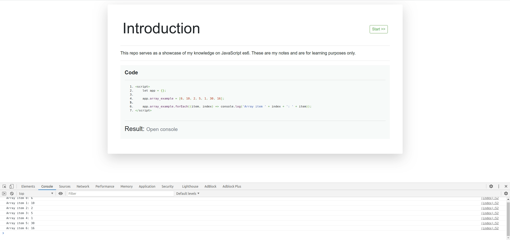

## About

### Brief

This repo demonstrates the lessons I went through while learning javascript ES6. The purpose of learning this is to write better and cleaner JavaScript for my projects. 

### Setup

Simply:
- Clone the repo 

```
git clone https://github.com/PeterKitonga/essixlearning.git
```
- Navigate to the project and click on the `index.html` file of a lesson

### Illustration


### Tutorial
Visit [Udemy](https://www.udemy.com/course/javascript-es6-tutorial) for the tutorial